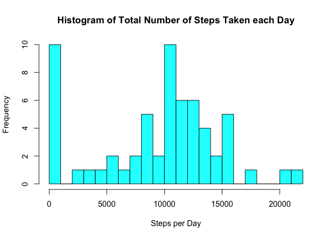
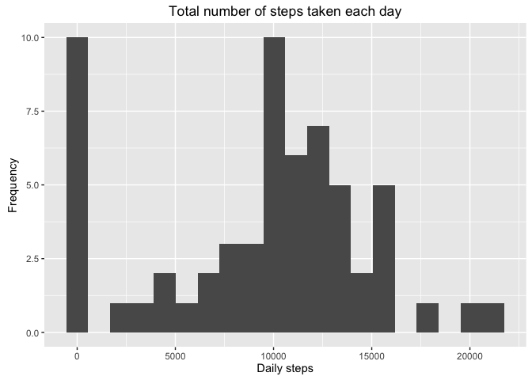
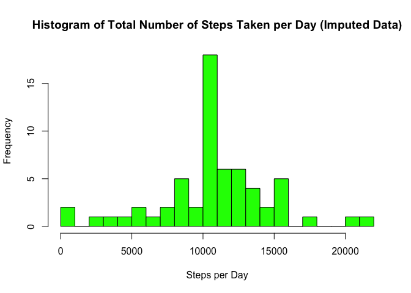
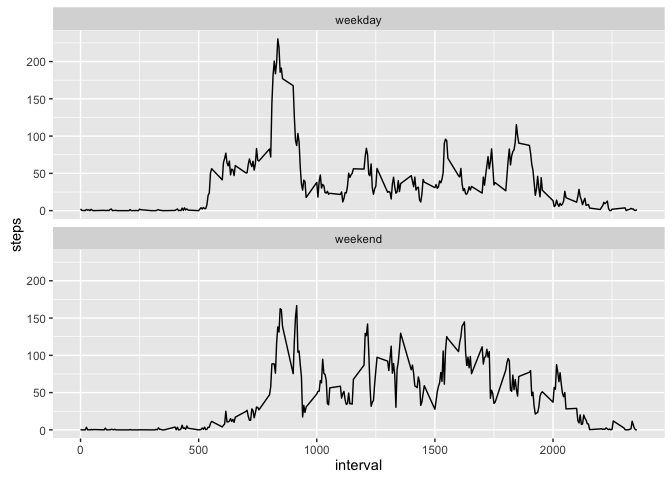

# Reproducible Research: Peer Assessment 1

Code for reading needed libraries:


```r
library(dplyr)
library(ggplot2)
```


## Loading and preprocessing the data

```r
#Change the working directory

activityData <- read.csv("activity.csv")

activityData$date <- as.Date(activityData$date, "%Y-%m-%d")
summary(activityData)
```

```
##      steps             date               interval     
##  Min.   :  0.00   Min.   :2012-10-01   Min.   :   0.0  
##  1st Qu.:  0.00   1st Qu.:2012-10-16   1st Qu.: 588.8  
##  Median :  0.00   Median :2012-10-31   Median :1177.5  
##  Mean   : 37.38   Mean   :2012-10-31   Mean   :1177.5  
##  3rd Qu.: 12.00   3rd Qu.:2012-11-15   3rd Qu.:1766.2  
##  Max.   :806.00   Max.   :2012-11-30   Max.   :2355.0  
##  NA's   :2304
```

## What is mean total number of steps taken per day?

```r
dat <- aggregate(activityData[1],by=activityData[2],FUN=sum,na.rm=TRUE)

hist(dat$steps,
     breaks=20,
     col = "cyan",
     main = "Histogram of Total Number of Steps Taken each Day",
     xlab = "Steps per Day")
```

<!-- -->

```r
#another way
daily_totals <- activityData %>%
                  group_by(date) %>%
                  summarise(stepcount = sum(steps, na.rm = TRUE))
daily_average <- activityData %>%
                   group_by (interval) %>%
                   summarise(avg_steps = mean(steps, na.rm = TRUE))

ggplot(daily_totals, aes(stepcount)) + 
  labs(title ="Total number of steps taken each day",
       x = "Daily steps",
       y = "Frequency") +
  geom_histogram(bins=20)
```

<!-- -->


## What is the average daily activity pattern?


```r
with(dat, mean(steps),na.rm=TRUE) # mean
```

```
## [1] 9354.23
```

```r
with(dat, median(steps),na.rm=TRUE) # median
```

```
## [1] 10395
```

## Imputing missing values


```r
nrow(activityData)        # total number of records
```

```
## [1] 17568
```

```r
sum(is.na(activityData))  # missing records
```

```
## [1] 2304
```

```r
library(plyr)
```

```
## -------------------------------------------------------------------------
```

```
## You have loaded plyr after dplyr - this is likely to cause problems.
## If you need functions from both plyr and dplyr, please load plyr first, then dplyr:
## library(plyr); library(dplyr)
```

```
## -------------------------------------------------------------------------
```

```
## 
## Attaching package: 'plyr'
```

```
## The following objects are masked from 'package:dplyr':
## 
##     arrange, count, desc, failwith, id, mutate, rename, summarise,
##     summarize
```

```r
   impute.mean <- function(x) replace(x, is.na(x), mean(x, na.rm = TRUE))
   activityData.impute <- ddply(activityData, ~interval, transform, steps = impute.mean(steps))
   
   activity.imp.dat <- aggregate(activityData.impute[1],activityData.impute[2],sum)

hist(activity.imp.dat$steps,
     breaks=20,
     col = "green",
     main = "Histogram of Total Number of Steps Taken per Day (Imputed Data)",
     xlab = "Steps per Day") 
```

<!-- -->

```r
mean(activity.imp.dat$steps)
```

```
## [1] 10766.19
```

```r
median(activity.imp.dat$steps)
```

```
## [1] 10766.19
```
## Are there differences in activity patterns between weekdays and weekends?


```r
day <- weekdays(activityData.impute$date)    #creating a vector day
day <- ifelse(day %in% c("Sunday","Saturday"),"weekend", "weekday") # converting to weekday and weekend

activity.impute <- cbind(activityData.impute,day) # adding the vector to dataframe


library(ggplot2)
activity.impute.interval <- aggregate(activity.impute[1],by= activity.impute[c(3,4)], FUN=mean,na.rm=TRUE)

adata.impute.interval <- aggregate(activity.impute[1],
                                   by=activity.impute[c(3,4)],
                                   FUN=mean,
                                   na.rm=TRUE)


ggplot(activity.impute.interval, aes(x= interval , y= steps))+ geom_line()+facet_wrap(~day,nrow=2)
```

<!-- -->
