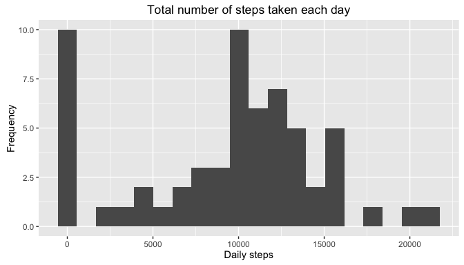
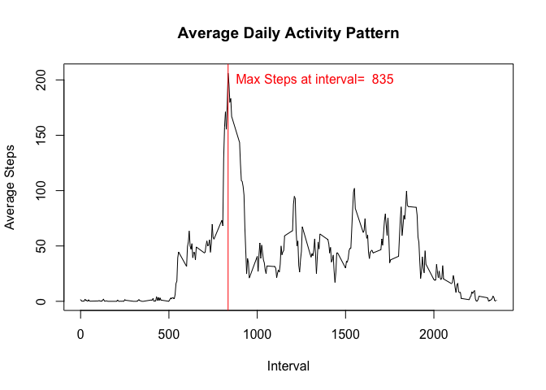
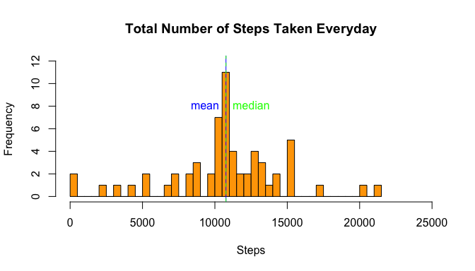
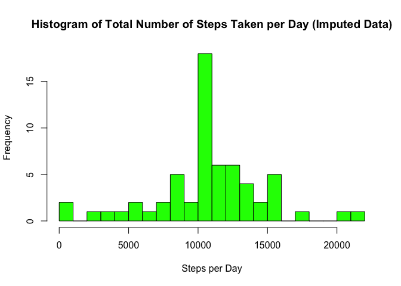
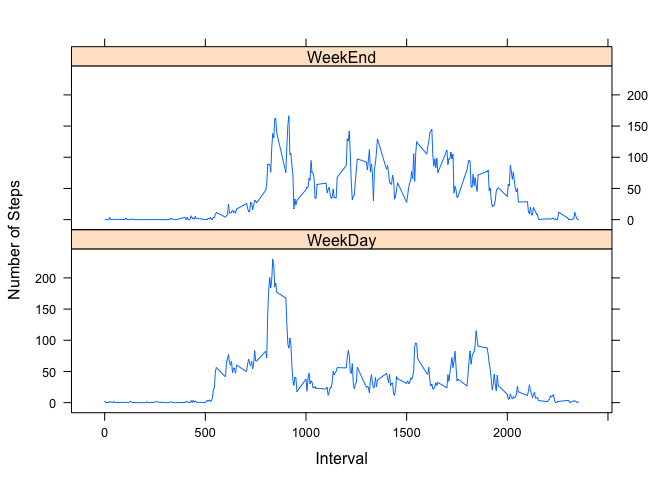

# Reproducible Research: Peer Assessment 1


```r
library(plyr)
library(dplyr)
library(ggplot2)
library(lattice)
```

## Loading and preprocessing the data

```r
activityData <- read.csv("activity.csv")
activityData$date <- as.Date(activityData$date, "%Y-%m-%d")

daily_totals <- activityData %>%
                  group_by(date) %>%
                  summarise(stepcount = sum(steps, na.rm = TRUE))
```

## What is mean total number of steps taken per day?


Since data is recorded every five minutes the data needs to be summed grouping by date
so that steps per day can be found.Mean can be found after per day steps calculation.

```r
activity.dailySteps<-aggregate(activityData$steps,by=list(activityData$date), sum)
names(activity.dailySteps)<-c('Date','Steps')

activity.steps_mean <-mean(activity.dailySteps$Steps,na.rm=TRUE)
activity.steps_median<-median(activity.dailySteps$Steps,na.rm=TRUE)
```
The mean of steps taken is **10766.19**  
The median of steps taken is **10765**

A Histrogram Showing daiy steps taken

```r
ggplot(daily_totals, aes(stepcount)) + 
  labs(title ="Total number of steps taken each day",
       x = "Daily steps",
       y = "Frequency") +
  geom_histogram(bins=20)
```

<!-- -->


## What is the average daily activity pattern?


```r
tidyActivity<-na.omit(activityData)
activity.StepsInIntervals<-aggregate(tidyActivity$steps,by=list(tidyActivity$interval), mean)
names(activity.StepsInIntervals)<-c('Interval','AverageSteps')
plot(activity.StepsInIntervals, type="l", xlab="Interval", ylab="Average Steps", main="Average Daily Activity Pattern")

IndexMaxSteps<- which.max(activity.StepsInIntervals$AverageSteps)
MaxSteps<-activity.StepsInIntervals[IndexMaxSteps,]$AverageSteps
InrervalMaxSteps<-activity.StepsInIntervals[IndexMaxSteps,]$Interval
abline(v= InrervalMaxSteps, lty=1,col="red")
text(InrervalMaxSteps,200, labels=paste("Max Steps at interval= ",InrervalMaxSteps) , col="red", pos=4)
```

<!-- -->

#### The time interval with the maximum number of steps on average is **835 to 840 **

## Imputing missing values

Note that there are a number of days/intervals where there are missing values (coded as NA). The presence of missing days may introduce bias into some calculations or summaries of the data.

1. Calculate and report the total number of missing values in the dataset (i.e. the total number of rows with NAs)

_There are total of **17568** Observations of which **2304** are missing values in the dataset ._

2. Devise a strategy for filling in all of the missing values in the dataset. The
strategy does not need to be sophisticated. For example, you could use
the mean/median for that day, or the mean for that 5-minute interval, etc.

_New data set shall be calculated by assiging average values of the time interval from all days._

3. Create a new dataset that is equal to the original dataset but with the
missing data filled in.


```r
#find vector of na values
isna<-is.na(activityData$steps)
missingdata <- activityData[isna,]
#find indexes of average steps data matching its interval to missing data.
missing_averagedataindex <- match(missingdata$interval,activity.StepsInIntervals$Interval)
newdata<- activityData
newdata$steps[isna] <- activity.StepsInIntervals$AverageSteps[missing_averagedataindex]
head(newdata)
```

```
##       steps       date interval
## 1 1.7169811 2012-10-01        0
## 2 0.3396226 2012-10-01        5
## 3 0.1320755 2012-10-01       10
## 4 0.1509434 2012-10-01       15
## 5 0.0754717 2012-10-01       20
## 6 2.0943396 2012-10-01       25
```

4. Make a histogram of the total number of steps taken each day and Calculate
and report the mean and median total number of steps taken per day. Do
these values differ from the estimates from the first part of the assignment?
What is the impact of imputing missing data on the estimates of the total
daily number of steps?


```r
newdata.dailySteps<-aggregate(newdata$steps,by=list(newdata$date), sum)
names(newdata.dailySteps)<-c('Date','Steps')

newdata.steps_mean <-mean(newdata.dailySteps$Steps,na.rm=TRUE)
newdata.steps_median<-median(newdata.dailySteps$Steps,na.rm=TRUE)
```
The mean of steps taken is **10766.19**  
The median of steps taken is **10766.19**

A Histrogram Showing daiy steps taken

```r
hist(newdata.dailySteps$Steps, main="Total Number of Steps Taken Everyday", xlab="Steps", breaks=50,col='orange',xlim=c(0,25000),ylim=c(0,12))

abline(v=newdata.steps_mean, lty=1, col="blue")
text(newdata.steps_mean,8, labels="mean", col="blue", pos=2)
abline(v=newdata.steps_median, lty=2, col="green")
text(newdata.steps_median,8, labels="median", col="green", pos=4)
```

<!-- -->
The difference in mean data after imputing data is
**0**
The difference in median data after imputing data is
**1.1886792**
Also the mean and median has become equal now.


```r
nrow(activityData)        # total number of records
```

```
## [1] 17568
```

```r
sum(is.na(activityData))  # missing records
```

```
## [1] 2304
```

```r
impute.mean <- function(x) replace(x, is.na(x), mean(x, na.rm = TRUE))
activityData.impute <- ddply(activityData, ~interval, transform, steps = impute.mean(steps))
   
activity.imp.dat <- aggregate(activityData.impute[1],activityData.impute[2],sum)

hist(activity.imp.dat$steps,
     breaks=20,
     col = "green",
     main = "Histogram of Total Number of Steps Taken per Day (Imputed Data)",
     xlab = "Steps per Day") 
```

<!-- -->

```r
mean(activity.imp.dat$steps)
```

```
## [1] 10766.19
```

```r
median(activity.imp.dat$steps)
```

```
## [1] 10766.19
```


## Are there differences in activity patterns between weekdays and weekends?

Create a new factor variable in the dataset with two levels - "weekday"
and "weekend" indicating whether a given date is a weekday or weekend
day.


```r
isWeekend<- ifelse(weekdays.Date(newdata$date)=='Sunday' | weekdays.Date(newdata$date) =='Saturday','WeekEnd','WeekDay')
newdata$dayType<-factor(isWeekend)
```

Make a panel plot containing a time series plot (i.e. type = "l") of the
5-minute interval (x-axis) and the average number of steps taken, averaged
across all weekday days or weekend days (y-axis).


```r
averageStepsbyInterval<-aggregate(newdata$steps,by=list(newdata$interval,newdata$dayType), mean)
names(averageStepsbyInterval)<-c('interval','day','averageSteps')
xyplot(averageSteps~interval|factor(day),
        data = averageStepsbyInterval,
       type='l',layout=c(1,2),
       xlab='Interval',ylab='Number of Steps')
```

<!-- -->
